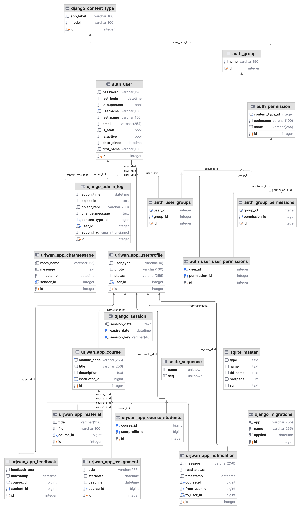

# Urjwan Learning Platform


## Features

- **User Authentication**: Secure login and registration using Django's built-in auth system.
- **Role-Based Access Control**: Different user types (students, instructors) with distinct permissions and access to certain views and actions.
- **Course Management**: Instructors can create courses, add materials, and assignments. Students can enroll in courses.
- **Assignments and Feedback**: Instructors can assign tasks and collect feedback from students.
- **Real-time Notifications**: WebSocket-based notifications for student enrollment, assignment updates, and course announcements.
- **Profile Management**: Students and instructors can update their profile information and status. Instructors can also manage their teaching responsibilities.
- **Dynamic Chat System**: One-on-one and group communication using WebSockets.
- **Responsive Design**: Tailwind CSS for a modern, responsive UI.

1. **Install dependencies**:
   - Ensure that Python 3.10 is installed.
   - Ensure that Docker is installed.
   - Ensure docker-compose is installed.

2. **Unzipping the project**:
   - Download the zipped project folder and unzip it into your desired directory.
  ```bash
     unzip urjwan -d urjwan
     cp .env.exemple .env
     docker-compose up
 ```

The server will be accessible at `http://0.0.0.0:8000/`.

## Folder Structure

```
urjw	an-elearning-platform/
urjwan-elearning-platform/
├── chat/
│   ├── __init__.py
│   ├── consumers.py
│   ├── routing.py
│   ├── models.py
│   └── views.py
│
├── media/
│
├── notifications/
│   ├── __init__.py
│   ├── consumers.py
│   ├── routing.py
│   ├── models.py
│   └── views.py
│
├── node_modules/
│
├── urjwan/
│   ├── __init__.py
│   ├── settings.py
│   ├── urls.py
│   ├── asgi.py
│   ├── wsgi.py
│
├── urjwan_app/
│   ├── migrations/
│   ├── static/
│   ├── templates/
│   ├── __init__.py
│   ├── admin.py
│   ├── apps.py
│   ├── consumers.py
│   ├── models.py
│   ├── routing.py
│   ├── views.py
│   └── urls.py
│
├── .gitignore
├── db.sqlite3
├── db_DDL.png
├── manage.py
├── package.json
├── package-lock.json
├── readme.md
├── requirements.txt
├── tailwind.config.js

```

## Architecture

### Models

- **UserProfile**: Extends the built-in Django user to handle roles (instructor, student), photos, and statuses.
- **Course**: Stores course details, the instructor, and student enrollments.
- **Assignment**: Tied to courses, stores assignment information and deadlines.
- **Notification**: Tracks course-related updates and notifies users in real-time via WebSockets.

### Views

- **Course Management**: Instructors can create and manage courses, as well as assign materials and assignments.
- **Student Enrollment**: Students can enroll in courses, and instructors can view and manage enrollments.
- **Profile Management**: Both students and instructors can update their profiles, including uploading profile pictures and updating statuses.

### WebSockets

- **Real-Time Notifications**: Notifications are managed through Django Channels, using WebSocket connections to push real-time updates to users' browsers.

### Testing

The platform includes comprehensive testing, covering:

- Model Validation
- URL Routing
- View Logic and Permissions
- Real-Time WebSocket Testing

### Database

The application uses **SQLite** in development but can be configured for **PostgreSQL** in production. The database schema follows a normalized structure to ensure data integrity and efficient querying.

### ER Diagram

Refer to the ER diagram below for a visualization of the relationships between models.


## Features and Requirements Delivered

1. **User Authentication & Role Management**
   Django's authentication system is extended via **UserProfile**, differentiating between students and instructors.

2. **Course Management**
   Instructors can create, manage, and delete courses. Students can enroll in courses.

3. **Assignments and Notifications**
   Real-time notifications using **WebSockets** notify students of new assignments, while feedback from students is also integrated.

4. **Profile Management**
   Users can manage their profiles, upload profile pictures, and update statuses.

5. **Real-Time Communication**
   WebSocket-based communication and notification system for immediate updates on course activities.

6. **Testing and Seed Data**
   The platform includes management commands for seeding the database and comprehensive test coverage for all key features.

7. **Tailwind CSS and Responsive Design**
   The UI uses **Tailwind CSS** for a clean and responsive layout. Additional jQuery handles client-side interactions and WebSocket communications.

## Requirements and Future Improvements

### Delivered:
- **Real-Time Notifications** for assignments and course updates.
- **Tailwind CSS** for responsive, modern UI.
- **Database Normalization** with a clear ER diagram.
- **Comprehensive User Management** through Django's built-in auth system.
- **WebSocket-Based Communication** using Django Channels.

### Future Improvements:
- Extend the chat system to include group discussions.
- Add more detailed analytics for instructors.
- Implement additional features such as grade tracking and assignment submissions.

## References

1. **Django Framework**
   - **Source**: [Django Official Documentation](https://docs.djangoproject.com/en/stable/)

2. **Tailwind CSS**
   - **Source**: [Tailwind CSS Official Documentation](https://tailwindcss.com/docs)

3. **jQuery**
   - **Source**: [jQuery Official Documentation](https://jquery.com/)

4. **CodePen Notification Design Inspiration**
   - **Source**: [CodePen](https://codepen.io/nick_bradley/pen/qBVGOpY)

5. **Profile Icons**
   - **Source**: [Freepik Alone Icon](https://www.freepik.com/icon/alone_5773070)

6. **Open Book Icon for Courses**
   - **Source**: [Freepik Open Book Icon](https://www.freepik.com/icon/open-book_4067471#fromView=search&page=2&position=43&uuid=cf90bfb5-de98-4f94-8928-dc59236882b0)
